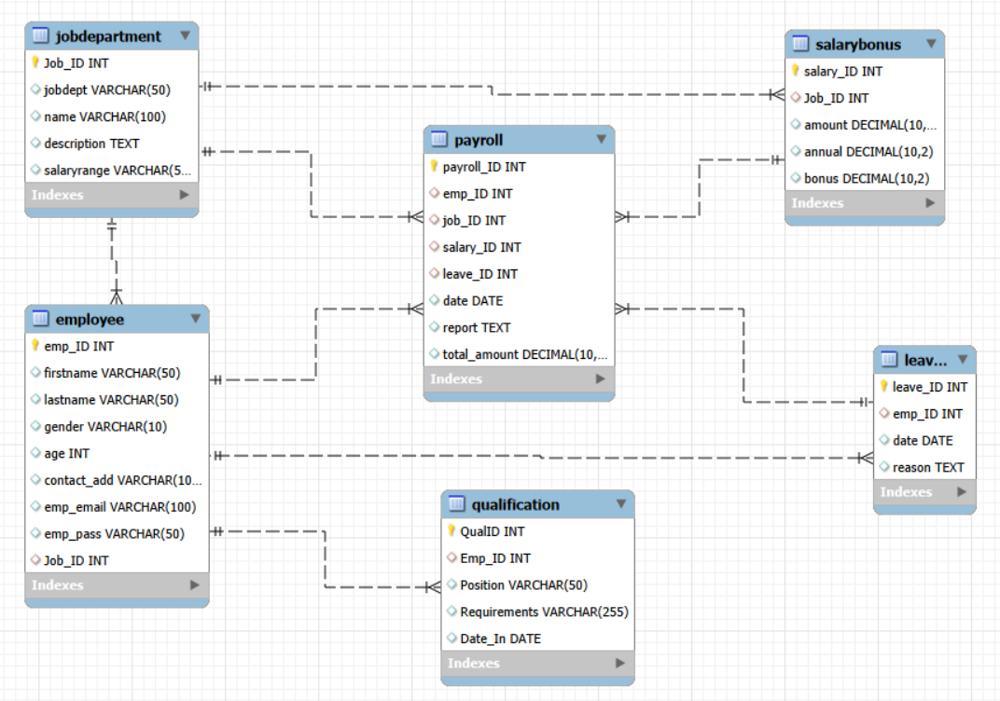

🧑‍💼 Employee Management System — SQL & HR Analytics

📌 Project Overview

The Employee Management System is a SQL-based relational database project designed to organize and analyze HR data across multiple business areas.

The database integrates employee information with departments, job roles, salaries, bonuses, qualifications, leave records, and payroll. SQL queries are used to combine related data, answer business questions, and generate HR insights.

---

🎯 Business Problem

Organizations need structured and accessible HR data to analyze workforce distribution, compensation, employee qualifications, leave, and payroll.

This project addresses this requirement by creating a relational database that:

- Organizes HR information across related tables
- Establishes relationships using Primary and Foreign Keys
- Enables efficient data retrieval through SQL
- Supports workforce and compensation analysis
- Provides data-driven insights for HR reporting

---

🛠️ Tools & Technologies

- MySQL — Relational Database Management System
- MySQL Workbench — Database development, SQL execution, and ER diagram design
- SQL — Data retrieval, transformation, and analysis

SQL Concepts Used

- Primary Keys & Foreign Keys
- INNER JOIN / Multi-table JOINs
- Aggregate Functions
- "GROUP BY"
- "WHERE" and filtering
- Date Functions
- Comparative Analysis

---

🗄️ Database Structure

The project contains six interconnected tables:

- JobDepartment — Department, job-role, job description, and salary-range information
- SalaryBonus — Salary, annual salary, and bonus information
- Employee — Employee information and assigned job roles
- Qualification — Employee qualification and position-related information
- Leaves — Employee leave dates and reasons
- Payroll — Employee payroll and compensation information

Primary and Foreign Key relationships enable analysis across these HR data domains.

---

🔗 Entity Relationship Diagram

The ER diagram illustrates the database entities and relationships used in the project.

---

📊 Business Questions

The project uses SQL to answer practical HR and business questions, including:

👥 Employee Workforce Analysis

- Which departments have the highest number of employees?
- Which departments have the largest workforce?
- What is the average salary by department?

💼 Job & Compensation Analysis

- Which job roles have the highest salaries?
- How does compensation vary across departments and job roles?
- Which departments have the highest salary allocation?

🎓 Qualification Analysis

- How many employees have qualification records?
- Which positions have qualification requirements?

🏖️ Leave Analysis

- Which year had the highest number of leave records?
- How are leave records distributed across departments?

💰 Payroll & Bonus Analysis

- What is the monthly payroll processed?
- What is the average bonus by department?
- Which department has the highest total bonus allocation?

---

🔍 SQL Analysis

SQL was used to extract and analyze information across multiple HR tables.

Key analytical operations included:

- JOINs to combine employee, department, salary, leave, qualification, and payroll information
- Aggregate Functions to calculate employee, salary, bonus, and payroll metrics
- GROUP BY to perform department and job-level analysis
- Filtering to identify specific records and business conditions
- Date-based Analysis to evaluate leave and payroll information
- Comparative Analysis to identify differences across departments and job roles

The complete SQL queries are available in "Employee_Management_System.sql".

---

📈 Key Findings

Analysis of the available dataset revealed:

- The database contains 60 employees.
- Finance and IT have the highest employee count, with 9 employees each.
- Legal has the highest average salary among departments.
- Director-level roles have the highest salaries in the dataset.
- Finance has the highest total salary allocation, at approximately ₹651K.
- All 60 employees have qualification records.
- The dataset contains 60 leave records, with one recorded leave instance per employee.
- Finance has the highest total bonus allocation, at approximately ₹96K.
- The April 2024 payroll processed was approximately ₹27.78 lakhs.

«Note: These findings are based on the available project dataset and should be interpreted within its scope and data structure.»

---

💡 Business Value

The analysis provides visibility into key HR metrics such as:

- Workforce distribution
- Department-level salary allocation
- Job-level compensation
- Bonus distribution
- Employee qualification coverage
- Leave records
- Payroll requirements

These insights can support HR reporting, workforce planning, compensation analysis, and management decision-making.

---

🧠 Skills Demonstrated

- MySQL
- MySQL Workbench
- SQL Query Development
- Relational Database Design
- ER Diagram Design
- Primary & Foreign Keys
- Multi-table JOINs
- Aggregate Functions
- GROUP BY Analysis
- Filtering & Date-based Analysis
- HR Analytics
- Business-oriented Data Analysis
- Data-driven Insight Generation

---

🚀 Future Enhancements

- Add historical employee and payroll data
- Expand attendance and leave records
- Introduce additional HR KPIs
- Develop an interactive HR analytics dashboard
- Integrate the database with Power BI or another BI platform

---

👤 Author

Hema Bonagiri

Aspiring Data Analyst | SQL | Python | Excel | Power BI
